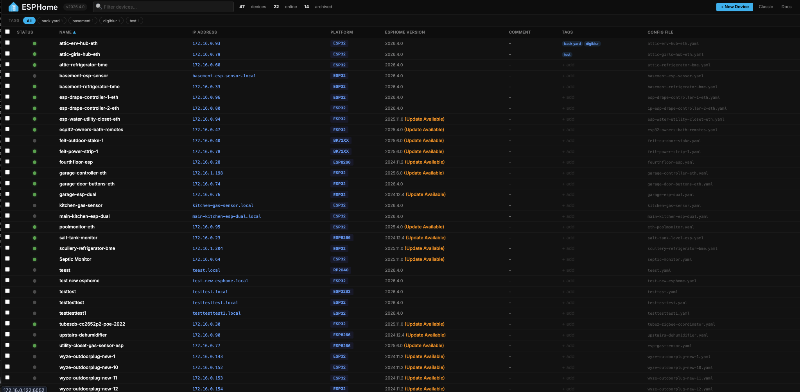
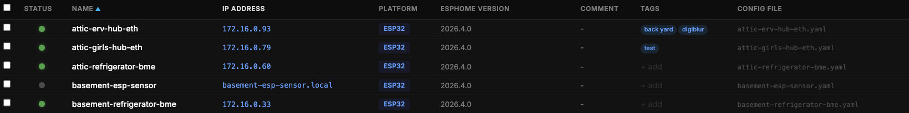
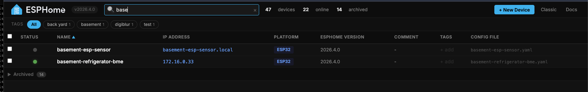
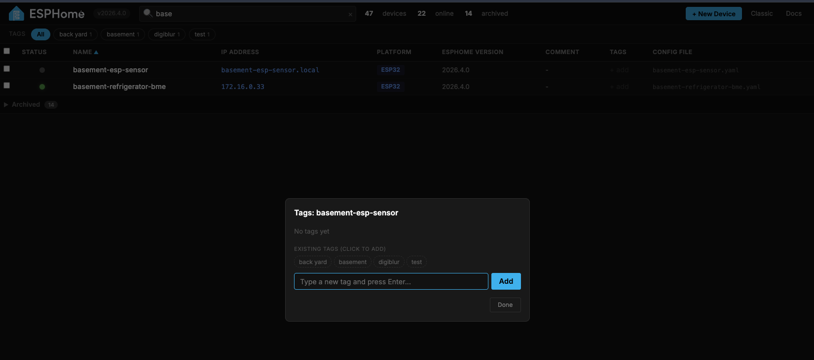
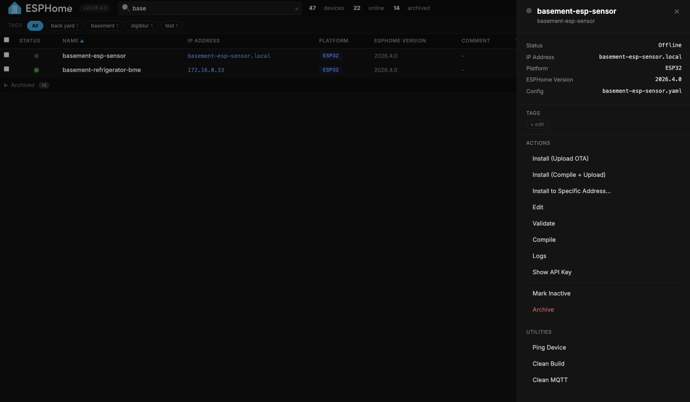
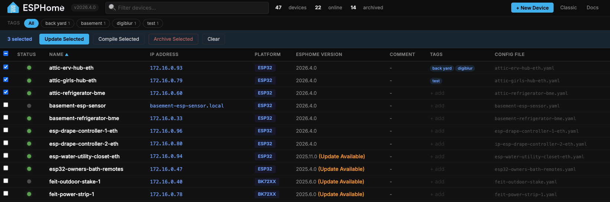
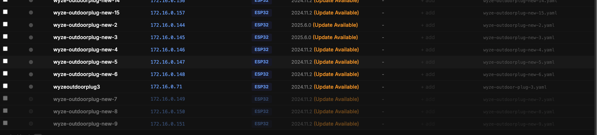
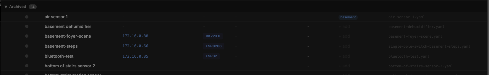

# ESPHome Enhanced Dashboard

A modern, dark-themed replacement for the stock ESPHome dashboard. Built as an overlay on top of the official ESPHome Docker image — your devices keep compiling, uploading, and connecting exactly as before, but the management UI gets a serious upgrade.

The original ESPHome dashboard is preserved and available at `/classic`.

**Current base:** ESPHome 2026.4.0
**Docker image:** [`heffneil/esphome-enhanced-dashboard`](https://hub.docker.com/r/heffneil/esphome-enhanced-dashboard)
**Upstream PR:** [esphome/esphome#15704](https://github.com/esphome/esphome/pull/15704)

---

## Overview

> _Screenshot: main dashboard view with device table, tags bar, and side panel_
> _Place image at: `docs/screenshots/overview.png` and update the link below_
>
> 

The enhanced dashboard replaces the stock card-based layout with a compact, sortable, searchable table that scales to dozens of devices without getting unwieldy. Click any row to open a side panel with every per-device action. Everything else you'd expect from ESPHome — compiling, OTA uploads, live logs, YAML editing — is wired into the new UI without losing any functionality.

---

## Features

### Device table

> _Screenshot: zoomed-in view of the table showing columns, status dots, tags, version indicators_
>
> 

- **Compact sortable columns** — Status, Name, IP Address, Platform, ESPHome Version, Comment, Tags, Config File
- **Live status dots** — green (online), gray (offline), orange (unknown), hollow (inactive)
- **"Update Available" indicator** next to the version when deployed version doesn't match
- **Clickable IP** — opens the device's web UI in a new tab (when the device has `web_server` enabled)
- **Click anywhere on a row** to open the side panel with device details and actions

### Search, filter, and sort

> _Screenshot: search bar filtering devices with tag pills highlighted_
>
> 

- **Live search** across name, friendly name, comment, IP, and config filename
- **Sort by any column** — click the header, click again to reverse
- **Tag filter bar** with quick-click pills (OR logic — click multiple tags to see devices matching any)
- Filter, sort, and search all compose together

### Device tags

> _Screenshot: tag editor modal showing pills + "Existing tags" pool_
>
> 

- Add custom tags to any device (e.g. "basement", "sensors", "outdoor")
- **Pool of existing tags** displayed when editing — click to reuse across devices
- Tags persist in `<config>/.esphome/device-tags.json`
- Quick-filter by tag via the tag bar below the topbar

### Side panel actions

> _Screenshot: side panel open with a device, showing Actions + Utilities sections_
>
> 

Click any device row and a panel slides in from the right with:

**Actions**
- **Update** — if an update is available, one-click compile + upload to the target version
- **Install (Upload OTA)** — OTA upload the existing build
- **Install (Compile + Upload)** — full compile then upload
- **Install to Specific Address…** — prompt for any IP/hostname and upload there (great for recovery or devices that moved)
- **Edit** — in-page Ace editor with YAML syntax highlighting
- **Validate** — check the config for errors
- **Compile** — build firmware without uploading
- **Logs** — live streaming serial/WiFi logs
- **Visit Device** — opens the device's web UI if it has one
- **Show API Key** — reveals the device's encryption key in a modal
- **Mark Inactive / Mark Active** — stop pinging a temporarily disconnected device
- **Archive** — move the config to the archive folder

**Utilities**
- **Ping Device** — ICMP ping with latency / packet loss / jitter results
- **Clean Build** — nuke the PlatformIO build cache
- **Clean MQTT** — remove MQTT discovery entries

### Batch actions with checkboxes

> _Screenshot: multiple rows checked with the blue batch bar showing "3 selected"_
>
> 

- Checkbox on the left of every active row
- **Select all** checkbox in the header
- Blue action bar appears when anything is selected
- **Update Selected** — compile + upload each device sequentially with live progress
- **Compile Selected** — compile-only batch
- Summary report at the end showing success/failure per device

### In-page command output

- All commands (logs, compile, validate, install, ping) run in a modal overlay on top of the dashboard
- ANSI colors preserved — component names, errors, timestamps, all highlighted just like the classic dashboard
- **DOWNLOAD LOGS** button saves a full .txt of the output
- **EDIT** button jumps straight to the YAML editor
- Press `Esc` or click the backdrop to close

### YAML editor

- Embedded Ace editor with tomorrow-night theme
- YAML syntax highlighting, auto-indent, line numbers
- **Ctrl+S / Cmd+S** to save
- Unsaved-changes warning if you try to close with pending edits

### Mark Inactive

> _Screenshot: inactive device dimmed at the bottom of the list_
>
> 

- Dims a device to 40% opacity
- Sorts it to the bottom of the list (below offline, above archived)
- **Stops the ping loop from polling it** — no more red/offline churn for devices you know are unplugged
- Perfect for seasonal devices, dev boards you're not using, or anything temporarily offline

### Archive & restore

> _Screenshot: archived section expanded at the bottom of the table_
>
> 

- Archive a device → YAML moves to `<config>/archive/`
- Archived devices appear in a collapsible section at the bottom
- Click an archived row → side panel shows **Restore from Archive** and **View YAML**
- One click to bring it back

### New Device wizard

- Click **+ New Device** in the topbar
- Fill in name, platform (ESP32 family, ESP8266, RP2040, BK72xx, RTL87xx, LN882x), board, WiFi credentials
- Optional device password for OTA security
- Backend auto-generates API encryption key and OTA password
- New device appears in the list immediately

---

## Install

### Option 1: Docker image (recommended)

Swap your image name. No volume mounts, no file copying — everything is baked in.

**Docker Compose:**

```yaml
services:
  esphome:
    image: heffneil/esphome-enhanced-dashboard:latest
    container_name: esphome
    restart: unless-stopped
    ports:
      - "6052:6052"
    volumes:
      - /path/to/your/config:/config
      - /etc/localtime:/etc/localtime:ro
```

```bash
docker compose up -d
```

**Docker run:**

```bash
docker run -d \
  --name esphome \
  -p 6052:6052 \
  -v /path/to/your/config:/config \
  --restart unless-stopped \
  heffneil/esphome-enhanced-dashboard:latest
```

### Option 2: Volume mount overrides

Keep the official ESPHome image and overlay just the dashboard files:

```bash
git clone https://github.com/heffneil/esphome-enhanced-dashboard.git /opt/esphome-dashboard
```

```yaml
services:
  esphome:
    image: esphome/esphome
    container_name: esphome
    restart: unless-stopped
    ports:
      - "6052:6052"
    volumes:
      - /path/to/your/config:/config
      - /etc/localtime:/etc/localtime:ro
      # Enhanced dashboard overrides
      - /opt/esphome-dashboard/overrides/models.py:/esphome/esphome/dashboard/models.py
      - /opt/esphome-dashboard/overrides/const.py:/esphome/esphome/dashboard/const.py
      - /opt/esphome-dashboard/overrides/web_server.py:/esphome/esphome/dashboard/web_server.py
      - /opt/esphome-dashboard/overrides/core.py:/esphome/esphome/dashboard/core.py
      - /opt/esphome-dashboard/overrides/status/ping.py:/esphome/esphome/dashboard/status/ping.py
      - /opt/esphome-dashboard/overrides/templates:/esphome/esphome/dashboard/templates
```

### Option 3: Build from source

```bash
git clone https://github.com/heffneil/esphome-enhanced-dashboard.git
cd esphome-enhanced-dashboard
docker build -t my-esphome-dashboard .
```

Pin to a specific ESPHome version:

```bash
docker build --build-arg BASE_VERSION=2026.4.0 -t my-esphome-dashboard .
```

### Image tags

- **`:latest`** — stable, only updated after testing
- **`:dev`** — development build, may contain unreleased features
- **`:2026.4.0`** — pinned to a specific ESPHome base version
- **`:v0.1.0`, `:v0.2.0`** — pinned release versions

---

## Upgrading

**Docker image (Option 1):**
```bash
docker compose pull && docker compose up -d
```

**Volume mounts (Option 2):**
```bash
cd /opt/esphome-dashboard
git pull
docker restart esphome
```

**Build from source (Option 3):**
```bash
cd esphome-enhanced-dashboard
git pull
docker build -t my-esphome-dashboard .
docker compose up -d
```

---

## Reverting

**Docker image:** Change `image:` back to `esphome/esphome` and restart.
**Volume mounts:** Remove the override volume lines and restart.

The classic dashboard is always preserved at `http://your-host:6052/classic` as long as the image is running.

---

## How it works

ESPHome's Python package lives inside the container at `/esphome/esphome/`. Our image (or the volume-mount overrides) replaces these files:

| File | Changes |
|---|---|
| `web_server.py` | Routes `/` to new template; adds `/classic`, `/device-tags`, `/toggle-inactive`, `/ping-host` endpoints |
| `core.py` | Adds tag and inactive device storage (JSON in config dir) |
| `models.py` | Adds `tags`, `inactive`, `archived` fields to device API response |
| `const.py` | Adds `entry_archived` / `entry_unarchived` WebSocket events |
| `status/ping.py` | Skips polling for inactive devices |
| `templates/index.template.html` | New dashboard UI (self-contained, no build step) |

Everything else — PlatformIO, compile toolchains, OTA, mDNS, API auth, Home Assistant ingress — is untouched.

## Storage

| Data | Location |
|---|---|
| Tags | `<config>/.esphome/device-tags.json` |
| Inactive devices | `<config>/.esphome/inactive-devices.json` |
| Archived configs | `<config>/archive/` |

Everything lives in your config volume and survives container recreation.

---

## Troubleshooting

**Dashboard still shows the stock UI**
- Hard refresh: `Ctrl+Shift+R` (or `Cmd+Shift+R` on Mac)
- Confirm the container restarted
- Verify the template inside the container:
  ```bash
  docker exec esphome ls /esphome/esphome/dashboard/templates/
  ```

**Compile fails with `xtensa-lx106-elf-g++: not found`**

PlatformIO toolchains download on first compile. Add a named volume to persist them:
```yaml
volumes:
  - esphome-platformio:/root/.platformio
```

**Ping Device can't resolve `.local` names**

`.local` hostnames use mDNS. If your Docker container is on a bridge network, it can't see mDNS. Either use the device's IP address directly, or put the container on the host network:
```yaml
network_mode: host
```

**WebSocket keeps reconnecting**

Usually a reverse proxy issue. For nginx:
```nginx
proxy_http_version 1.1;
proxy_set_header Upgrade $http_upgrade;
proxy_set_header Connection "upgrade";
```

---

## Contributing

This repo tracks the upstream PR at [esphome/esphome#15704](https://github.com/esphome/esphome/pull/15704). If you have ideas or bug reports, open an issue here or comment on the PR.

## License

Same as upstream ESPHome — see [LICENSE](https://github.com/esphome/esphome/blob/dev/LICENSE). The override files in this repo are derivatives of the ESPHome dashboard source.
